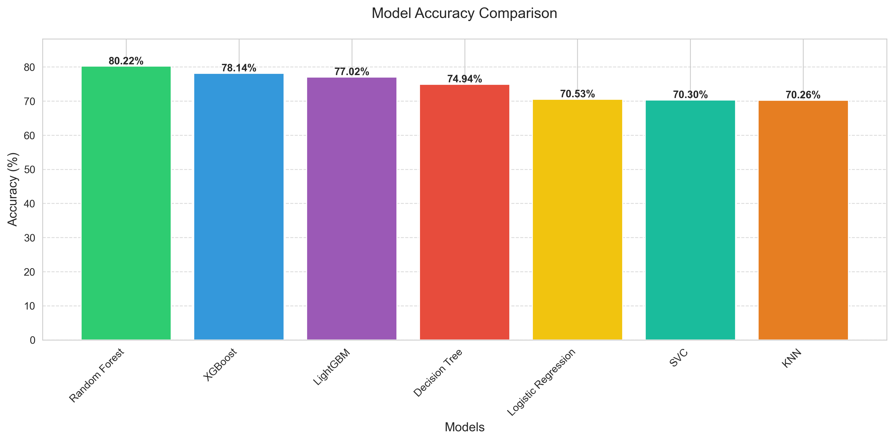

# Food Delivery Time Predictor

A machine learning-powered web application that predicts food delivery times based on various factors like location, cuisine type, cost, and restaurant ratings.

## 🌟 Features

- Location-based delivery time prediction
- Multiple cuisine selection (up to 5 cuisines)
- Real-time predictions using multiple ML models
- Interactive web interface
- Model accuracy comparison visualization
- Responsive design for all devices

## 🚀 Live Demo

Visit the live application: [Food Delivery Time Predictor](https://code-craft-orcin-seven.vercel.app)

## 🛠️ Tech Stack

- **Frontend**: HTML, CSS, JavaScript, Bootstrap 5
- **Backend**: Flask (Python)
- **Machine Learning**: scikit-learn, XGBoost, LightGBM, RandomForestGenerator
- **Deployment**: Vercel

## 🚀 Installation Steps

1. Clone the repository:
```bash
git clone https://github.com/PushkarPisolkar04/CodeCraft.git
cd CodeCraft
```

2. Create virtual environment:
```bash
python -m venv venv
venv\Scripts\activate  # For Windows
source venv/bin/activate  # For Linux/Mac
```

3. Install dependencies:
```bash
pip install -r requirements.txt
```

4. Run the application:
```bash
python app.py
```

5. Open http://localhost:5000 in your browser

## 📊 Machine Learning Models

The application uses multiple models for prediction:
- Random Forest
- XGBoost
- LightGBM
- Decision Tree
- K-Nearest Neighbors
- Support Vector Machine

## 📈 Model Performance



The graph above shows the comparative accuracy of different machine learning models used in our system. Each model was trained and tested on the same dataset to ensure fair comparison.

## 👥 Contributors

Special thanks to our team members who contributed to this project:

1. Bhavik Pimpalkar
2. Gayatri Jadhav
3. Pushkar Pisolkar
4. Rishi Joshi
5. Shruti Jauhari
6. Vivek Sonpimple 
